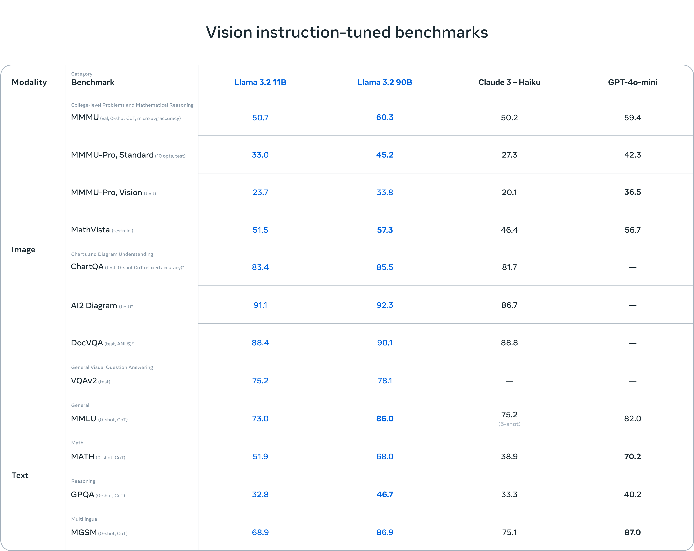

# LLaMA 3.2 Overview

---

Welcome to the introduction to **LLaMA 3.2**—the latest in a series of large language models designed to close the gap between **open-source** models and proprietary giants like GPT, Gemmini, Claude and many others. If you're familiar with earlier versions of LLaMA, you're probably wondering: *What's new with LLaMA 3.2? Why does it matter?* Let's break that down.

## Why LLaMA 3.2 Exists

In recent years, large language models have made great strides in performance, but most of these advances have been limited to proprietary models owned by a few big tech companies. Open-source alternatives, while promising, often fell behind in terms of efficiency and scalability. This is where LLaMA 3.2 steps in.

**Motivation**: LLaMA 3.2 aims to provide the **same level of performance** (and in some cases, even better) as proprietary models but in a more **scalable** and **accessible** way. Think of it as a democratization of cutting-edge AI—**efficient**, **scalable**, and **open** to everyone.

### Key Features of LLaMA 3.2

To get a better grasp of why LLaMA 3.2 is special, let's look at its standout features:

1. **Improved Efficiency**: With more advanced **pre-training techniques**, LLaMA 3.2 achieves high performance while requiring fewer resources.
   
2. **Scalability**: The model can easily be scaled up or down, allowing it to be fine-tuned and deployed across various environments with minimal friction.

3. **Accessibility**: Unlike its predecessors, LLaMA 3.2 is designed to be easier to fine-tune, especially with smaller datasets, lowering the barrier for teams with limited compute power.

4. **Versatility**: Whether you're looking at language generation, summarization, or even code generation, LLaMA 3.2 is versatile enough to handle a wide range of tasks.

---

## Why It Matters

Let's put this into perspective—why does LLaMA 3.2 matter for data scientists, engineers, and researchers?

1. **Efficient Model Deployment**: LLaMA 3.2 is **smaller** and more **resource-efficient** than most other models at its performance level, which means you can deploy it on more modest hardware setups without sacrificing too much in terms of results.

2. **Easier Fine-Tuning**: Thanks to its pre-training techniques, it's easier to fine-tune LLaMA 3.2 with fewer data and compute resources. This makes it a perfect choice for those who want to train specialized models but don't have access to extensive datasets.

3. **Open-Source Advantage**: As an open-source model, it can be customized, extended, or integrated into various applications without licensing fees or restrictions—something proprietary models can't offer.

---

#### Benchmarks for Lightweight Instruction-Tuned Models

LLaMA 3.2 demonstrates impressive performance across various benchmarks, particularly considering its smaller model sizes. Let's compare LLaMA 3.2's 1B and 3B models against other lightweight instruction-tuned models:

Key observations:
1. LLaMA 3.2 3B outperforms Gemma 2 2B IT on MMLU, showcasing its strong general language understanding.
2. Both LLaMA 3.2 models excel in the Open-rewrite eval, surpassing Gemma 2 2B IT and Phi-3.5 - Mini IT, indicating their effectiveness in real-world, open-source scenarios.
3. LLaMA 3.2 3B shows competitive performance in mathematical reasoning (GSM8K, MATH), especially compared to Gemma 2 2B IT, though there's room for improvement compared to Phi-3.5 - Mini IT.
4. In long context tasks, LLaMA 3.2 models demonstrate strong capabilities, particularly in the NIH/Multi-needle benchmark where they significantly outperform Phi-3.5 - Mini IT.
5. LLaMA 3.2 3B shows impressive multilingual capabilities in the MGSM benchmark, outperforming both Gemma 2 2B IT and Phi-3.5 - Mini IT.

These benchmarks highlight LLaMA 3.2's efficiency in achieving strong performance with fewer parameters, making it an attractive option for resource-constrained environments and applications requiring a balance of performance and efficiency.

#### Vision Instruct-Tuned Benchmarks

LLaMA 3.2 also showcases robust performance in vision-related tasks, particularly with its larger multimodal models (11B and 90B). Here's a comparison of LLaMA 3.2's performance against other vision-language models on various benchmarks:

Key insights:
1. LLaMA 3.2 90B model demonstrates competitive performance across all benchmarks, often rivaling or surpassing GPT-4v-mini, especially in vision-related tasks.
2. The 11B model shows impressive results for its size, outperforming some larger models on certain tasks and providing a strong balance between performance and efficiency.
3. LLaMA 3.2 models excel in vision tasks such as ChartQA and AI2 Diagram, showcasing their strong visual understanding capabilities.
4. In text-based tasks, LLaMA 3.2 demonstrates robust performance in MMLU and MGSM, highlighting its language understanding and multilingual capabilities.
5. The models exhibit balanced performance across different modalities, underlining their versatility in handling vision, image, and text-based tasks.

These benchmarks underscore LLaMA 3.2's capabilities in multimodal understanding and reasoning, positioning it as a formidable contender in the vision-language model space while also demonstrating strong competence in text-only tasks. The model's ability to perform well across various modalities and task types makes it a versatile choice for a wide range of applications, from academic research to industry implementations.

---

## Use Cases and Applications

While LLaMA 3.2 can handle typical natural language processing tasks (like text classification, summarization, and generation), its true strength lies in its **versatility**:

- **Content Generation**: Whether it's generating coherent articles, dialogues, or stories, LLaMA 3.2 excels at producing high-quality, contextually appropriate text.
- **Question Answering**: Fine-tuned versions of the model can be deployed to answer complex questions in real-time, even handling multiple languages.
- **Code Completion**: It's not just limited to natural language—LLaMA 3.2 is also a strong contender in code generation and completion tasks.
- **Edge Computing**: LLaMA 3.2 can be optimized for deployment on edge devices, enabling AI capabilities in resource-constrained environments:
  - **Smart Assistants**: Pruned or distilled versions of LLaMA 3.2 can power voice assistants or chatbots in smart home devices and wearables, providing real-time interaction.
  - **Healthcare Monitoring**: Its multimodal capabilities allow for processing both text and image data, making it useful for real-time medical diagnostics on edge devices while preserving data privacy.
  - **Autonomous Vehicles**: When optimized, LLaMA 3.2 can interpret visual inputs and textual data from vehicle sensors, enabling quick and reliable decision-making in safety-critical environments.

---

## The Future with LLaMA 3.2

LLaMA 3.2 represents a major step forward in the development of **open-source** AI, balancing efficiency, performance, and accessibility. For graduate-level students in data science, it opens the door to experimenting with cutting-edge models without the barriers imposed by large, proprietary systems.

By the end of this presentation, you'll gain a solid understanding of what makes LLaMA 3.2 stand out and why it is relevant to modern AI research and applications. Whether you're developing chatbots, working on translation models, or performing any task that requires understanding natural language, LLaMA 3.2 provides the foundation for innovative solutions.

---

### Ready to Dive In?

Let's explore more about how LLaMA 3.2 builds on its predecessors, how the architecture works, and why it could be your go-to model for a wide range of NLP tasks!

[LLaMA 3.2 Architecture Guide](./01_Llama-3.2-Architecture-Guide.md) 

---
