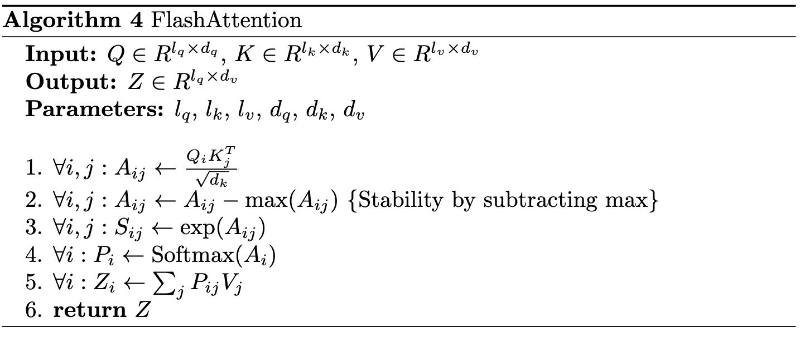
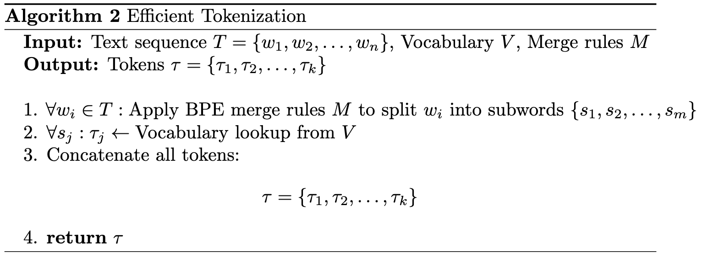
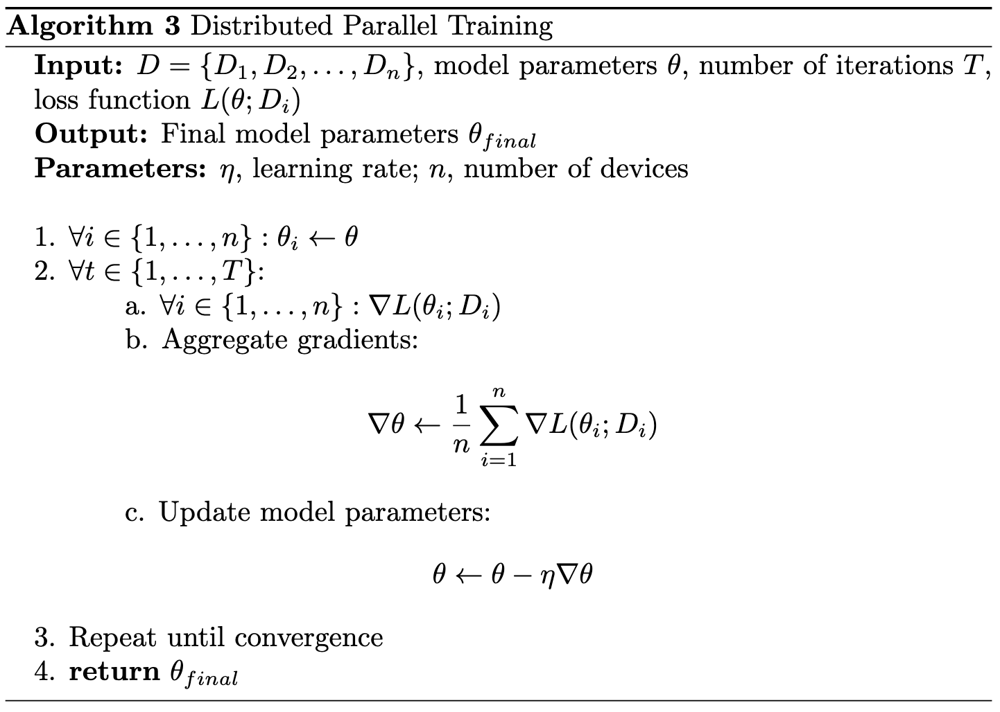

# LLaMA 3.2 Architecture Guide

---

## Introduction to LLaMA 3.2's Architecture

LLaMA 3.2 brings several **key advancements** to transformer architecture, which has become the backbone of modern NLP models. In this guide, we'll explore the major architectural components of LLaMA 3.2, focusing on its **attention mechanisms**, particularly the introduction of **flash attention**, and how it differs from previous iterations of the model.

---

## How LLaMA 3.2 Differs from its Predecessors

### Key Upgrades in LLaMA 3.2:

1. **Flash Attention**: This is the most notable difference between LLaMA 3.2 and its predecessors. Earlier versions relied on standard self-attention mechanisms, which scaled poorly with longer input sequences. Flash attention drastically reduces memory usage and improves speed for long sequences.

2. **Tokenization Efficiency**: While previous versions also used BPE, LLaMA 3.2's optimized tokenization reduces the number of tokens required, enhancing both memory and computational efficiency.

3. **Parallelization**: LLaMA 3.2 takes parallelization further by optimizing the distribution of workloads across multiple GPUs or processors, allowing for faster and more scalable deployments than earlier versions.

---

## What is Flash Attention?

**Flash attention** is a significant upgrade in how LLaMA 3.2 handles attention, making it more efficient while retaining performance. To understand flash attention, let's first break down the limitations of traditional self-attention mechanisms:

### The Problem with Traditional Self-Attention

In a typical transformer, the **attention mechanism** requires calculating the **dot products** between query, key, and value matrices for every token pair in a sequence. This leads to a quadratic computational complexity, **O(n²)**, where **n** is the sequence length. As the sequence grows, the time and memory required to process it escalate rapidly.

This becomes especially problematic when working with **long sequences** (e.g., entire documents or transcripts), as it can strain memory resources and slow down the model.

### Flash Attention to the Rescue

**Flash attention** is designed to address this bottleneck by significantly **reducing memory usage** while keeping the computational workload manageable.

#### How Flash Attention Works:
Instead of calculating the attention weights all at once (leading to high memory consumption), **flash attention** breaks the process into **small, manageable blocks**. It uses a memory-efficient algorithm that computes the attention scores in **chunks** and **streams them** through the attention layers.

This method not only lowers memory consumption but also avoids the need to store intermediate activations (which typically inflate memory use). By computing attention in blocks, flash attention processes the input in a **more parallelized** and **streamlined manner**, optimizing both memory and computation.

### Key Benefits of Flash Attention:

1. **Linear Scaling**: Flash attention reduces the **quadratic scaling** of self-attention mechanisms, allowing LLaMA 3.2 to handle much longer sequences efficiently.
   
2. **Memory Efficiency**: By computing attention in small chunks and avoiding large intermediate activations, memory usage is greatly reduced.

3. **Faster Processing**: The architecture allows for more **parallelized** operations, which translates into faster inference times, particularly for long sequences.

4. **Handling Longer Contexts**: Flash attention enables LLaMA 3.2 to handle **longer context windows** more efficiently than its predecessors, making it ideal for tasks that require extended input sequences, such as document summarization or long-form content generation.

---

## Tokenization Improvements

One of the improvements in LLaMA 3.2 is the **enhanced tokenization** method that builds on traditional approaches. Tokenization, in essence, is the process of breaking down text into units (tokens) that the model can understand and process. LLaMA 3.2 continues to use **Byte Pair Encoding (BPE)** but has optimized it for greater efficiency.

### Why This Matters:
- **Fewer Tokens**: The model requires fewer tokens to represent the same input text, leading to faster processing times and reduced computational overhead.
- **Memory Efficiency**: With fewer tokens to process, the memory required for tokenization decreases, allowing the model to handle **longer sequences** without running out of resources.

### How Tokenization Works in LLaMA 3.2:

LLaMA 3.2 uses an **advanced version of Byte Pair Encoding (BPE)**, a subword segmentation algorithm that merges the most frequent pairs of characters or character sequences in the text. This ensures that even rare or compound words are tokenized into **efficient subunits**, minimizing the number of tokens required.

For instance, the word **"lower"** might initially be tokenized as `['l', 'o', 'w', 'e', 'r']`. Over iterations, these tokens are merged into larger subunits such as `['low', 'er']`. This optimized tokenization reduces redundancy and enables the model to **process inputs faster** without sacrificing accuracy.

---

## Parallelization Enhancements

Another key feature in LLaMA 3.2 is its improvement in **parallelization**. This refers to the ability to split computations across multiple processors, speeding up the model's inference and training processes.

### What's New with Parallelization?

While previous versions of LLaMA could already parallelize certain computations, **LLaMA 3.2** has been optimized to handle this process even more efficiently. In particular, the model's architecture has been **restructured** to better distribute attention and tokenization processes across multiple processing units (e.g., GPUs).

- **Lower Latency**: By spreading the workload across multiple units, LLaMA 3.2 reduces inference time, making it faster in real-time applications.
- **Improved Scalability**: LLaMA 3.2 can scale across a larger number of GPUs, making it suitable for deployments in **high-performance environments** or distributed systems.

---

## Conclusion

LLaMA 3.2 introduces **significant architectural advancements**, most notably the adoption of **flash attention**, which offers a huge boost in efficiency, particularly for long sequences. This allows the model to process more data in less time, without the heavy memory demands of traditional attention mechanisms. 

Additionally, **tokenization** and **parallelization** improvements make LLaMA 3.2 faster and more scalable, positioning it as a model ready to handle a wide range of **natural language processing tasks**—from short prompts to long-form text generation.

These architectural upgrades ensure that **LLaMA 3.2** is a model built not only for today's needs but also for the future of large-scale language processing.

---

[The Backbone of Llama 3.2](02_llama-satck.md)