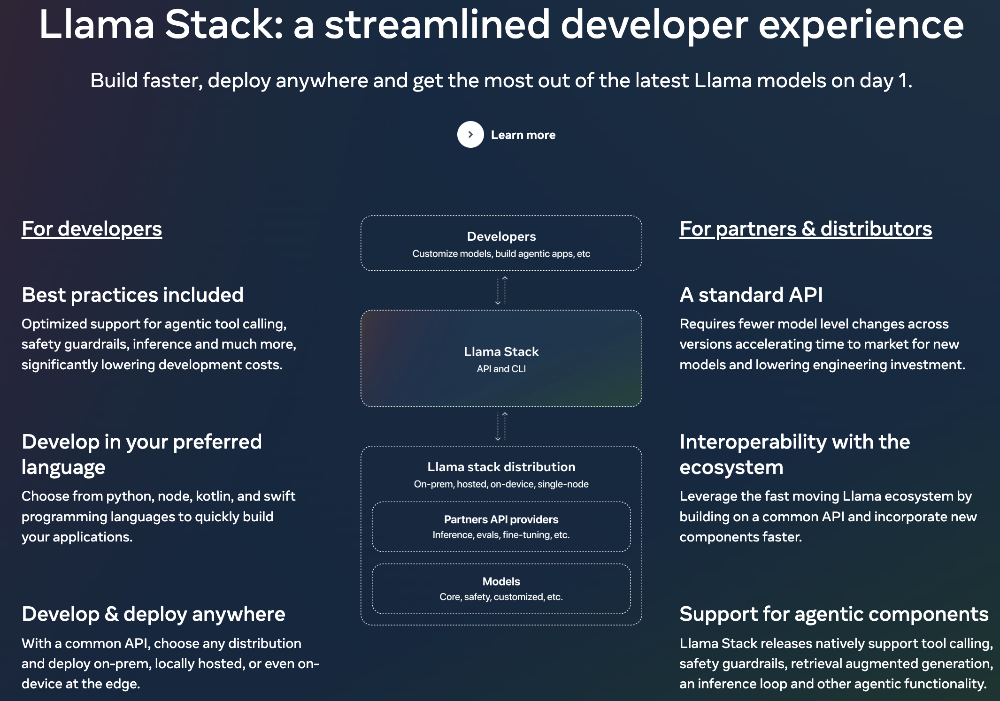

# Understanding the LLaMA 3.2 Stack

---

## Introduction to the LLaMA Stack

The **LLaMA Stack** is an integral part of the **LLaMA 3.2** ecosystem, designed to streamline the development, deployment, and fine-tuning of AI models. The stack provides a standardized API and toolchain, allowing developers to work with LLaMA 3.2 models in various environments, from cloud and on-premise servers to edge devices. This modular system is built to simplify the lifecycle of AI development, including pre-training, fine-tuning, and deployment.

---

## Key Features of the LLaMA Stack

### 1. **Modular Architecture**
LLaMA Stack allows developers to easily customize models using a modular approach. Developers can mix and match APIs for different tasks and applications. Whether you’re deploying AI on the cloud, on-premise, or edge devices, the LLaMA Stack adapts seamlessly to your platform. 

- **Example**: For edge computing, lightweight versions of LLaMA (like 1B and 3B models) can be deployed efficiently, maintaining high performance while ensuring data privacy.

### 2. **Fine-Tuning and Data Generation**
LLaMA Stack simplifies the process of **fine-tuning** models for specific tasks. Developers can leverage synthetic data generation and the LLaMA CLI tool to build, configure, and deploy AI models quickly. Fine-tuning is essential when you need a specialized model for a domain-specific application, such as summarization, image captioning, or multilingual translation.

- **Key Tools**:
  - **LLaMA CLI**: Command-line interface to configure and run LLaMA models.
  - **Synthetic Data Generation**: Allows for the creation of high-quality datasets for fine-tuning models.

### 3. **Distribution Flexibility**
The LLaMA Stack supports multiple distribution environments, making it flexible for a wide range of deployment scenarios. These include:

- **Cloud-Based Deployment**: LLaMA models can be deployed on major cloud platforms like AWS, Databricks, and Azure.
- **On-Premise Deployment**: The stack integrates easily with on-premise hardware setups such as Dell servers.
- **On-Device (Edge) Deployment**: LLaMA’s lightweight models (e.g., 1B and 3B) are optimized to run efficiently on mobile devices powered by chips like Qualcomm and MediaTek. This makes LLaMA 3.2 ideal for on-device AI applications where low latency and privacy are paramount.

### 4. **Safety and Compliance with LLaMA Guard 3**
To ensure responsible AI, the LLaMA Stack integrates **LLaMA Guard 3**, a safety layer built into the models. This feature ensures that AI outputs align with ethical standards, and it filters prompts and results to avoid potentially harmful content.

- **LLaMA Guard 3** is especially useful for edge and mobile applications where data privacy and real-time decision-making are critical. 

### 5. **Standardized Tools for Developers**
The LLaMA Stack provides a comprehensive set of tools to simplify AI development. These include:

- **LLaMA CLI**: A command-line interface that helps developers configure and deploy models easily.
- **Docker Containers**: Pre-built Docker containers allow developers to run LLaMA Stack servers with minimal setup.
- **Client Code**: Available in multiple programming languages, including Python, Kotlin, Node, and Swift, ensuring broad compatibility for developers.
  
---

## Real-World Applications of LLaMA Stack

### **Healthcare and Finance**
Industries like healthcare and finance benefit from the **edge deployment** capabilities of LLaMA Stack. Lightweight models can run on edge devices, processing sensitive data without sending it to the cloud, ensuring privacy and security.

### **On-Device Personal Assistants**
LLaMA Stack makes it possible to deploy AI agents that can summarize messages, extract key action items, and even send calendar invites—all processed locally on the device without compromising data privacy.

---

## Conclusion

The **LLaMA 3.2 Stack** provides a developer-friendly, modular, and scalable framework that simplifies AI development from pre-training to deployment. By offering flexible distribution options, fine-tuning tools, and safety mechanisms, the LLaMA Stack allows developers to deploy AI solutions in cloud, on-premise, and edge environments. Whether you’re building complex cloud-based applications or privacy-focused edge AI, the LLaMA Stack equips you with everything needed to succeed in modern AI development.

---