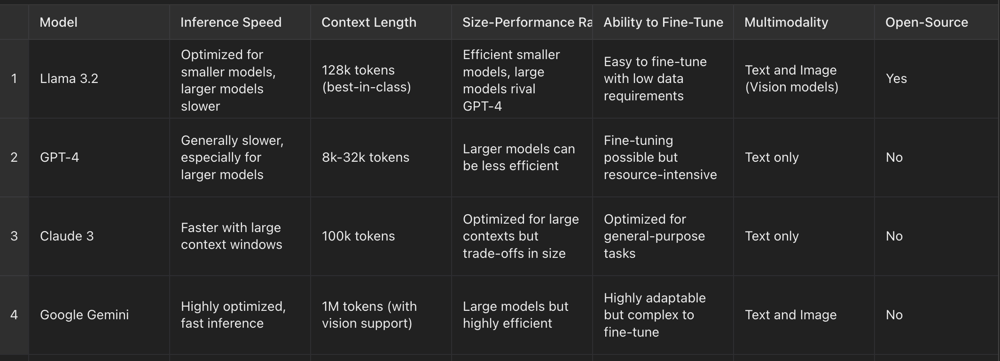

# Limitations of LLaMA 3.2

---

## Introduction

While **LLaMA 3.2** presents a number of advances in efficiency and scalability, no model is without its limitations. Understanding these limitations is crucial when determining how to use the model in real-world applications. This section outlines some of the key constraints in performance, fine-tuning, scalability, and deployment for **LLaMA 3.2**.

---

## 1. Inference Speed and Computational Cost

### Limitation:
Although **LLaMA 3.2** is more optimized than its predecessors, particularly with the introduction of **flash attention** and **tokenization improvements**, inference speed remains a challenge for larger models. **LLaMA 3.2** models, especially the larger versions (e.g., 11B and 90B), still require substantial computational power during both training and inference.

### Impact:
This means that real-time applications such as conversational agents or autonomous systems may still face **latency issues**, especially when deployed in environments with limited processing power or when handling long input sequences. The high **computational cost** can also make training or fine-tuning these larger models expensive, especially for smaller companies or research institutions.

### Mitigation Strategies:
- Utilizing the **smaller model versions** (such as 1B and 3B) can mitigate some of the latency and computational costs.
- Techniques such as **quantization** and **pruning**, which reduce model size and precision without a significant drop in performance, can help optimize deployment on edge devices.

---

## 2. Context Length

### Limitation:
While **LLaMA 3.2** can handle longer contexts (up to **128K tokens**) compared to previous models, there are still tasks where this context window might be insufficient, particularly in fields such as **legal document analysis** or **multimodal tasks** that involve both text and vision inputs. Models such as **Google Gemini** can handle even longer contexts, offering more flexibility for those specific use cases.

### Impact:
For applications that require deep contextual understanding over **long sequences**, LLaMA 3.2’s context length might not be enough. This limitation is particularly felt in sectors like healthcare, legal, or scientific research, where extensive documents or reports need to be processed continuously.

### Mitigation Strategies:
- Consider splitting tasks into smaller context windows and processing them in parallel.
- Use **task-specific fine-tuning** to enhance the model’s ability to handle such specialized tasks, though this might still not fully overcome the limitation of the context window.

---

## 3. Memory Consumption

### Limitation:
Even though LLaMA 3.2 has improved memory efficiency through **flash attention** and optimized **tokenization**, the larger models (such as **11B and 90B**) still consume significant amounts of memory, especially during fine-tuning and deployment.

### Impact:
Memory requirements pose challenges when deploying LLaMA 3.2 on **edge devices** or in environments with limited computational resources. For example, mobile devices or IoT setups may struggle to run the larger models efficiently without significant optimizations.

### Mitigation Strategies:
- Rely on **model compression techniques** such as **knowledge distillation** and **pruning** to reduce the size of the model without a major sacrifice in performance.
- Opt for the **lighter 1B or 3B models**, which are specifically optimized for edge computing, mobile, and other resource-constrained environments.

---

## 4. Fine-Tuning Complexity

### Limitation:
While LLaMA 3.2 introduces **easier fine-tuning methods**, such as **Low-Rank Adaptation (LoRA)**, fine-tuning larger models (especially 11B and above) can still be highly resource-intensive, requiring substantial data and compute power. Fine-tuning these models in real-world environments might still pose a barrier for smaller research teams or startups without access to large-scale infrastructure.

### Impact:
Teams working on smaller or highly specialized datasets may find it challenging to fine-tune LLaMA 3.2 for their needs, especially if the model requires considerable adjustments or training on domain-specific data. This could limit its adoption for certain specialized applications.

### Mitigation Strategies:
- Use **smaller LLaMA models** that require less compute and data for fine-tuning.
- Explore parameter-efficient fine-tuning techniques such as **LoRA** or **adapter layers** to fine-tune only parts of the model without modifying the entire architecture.

---

## 5. Multimodal Limitations

### Limitation:
Although **LLaMA 3.2** introduces support for **multimodal capabilities** (especially in the **11B and 90B vision models**), its multimodal performance is still relatively new and untested compared to other models that have been designed from the ground up for text-image tasks.

### Impact:
For complex tasks that require advanced multimodal understanding (e.g., vision and text integration for detailed image recognition tasks or video analysis), **LLaMA 3.2** might not perform at the highest level compared to other state-of-the-art multimodal models, such as **OpenAI’s GPT-4 Vision** or **Google’s Gemini**.

### Mitigation Strategies:
- Fine-tune the vision models specifically for the desired multimodal task using **domain-specific data**.
- Consider using LLaMA 3.2 for less computationally intensive multimodal tasks, such as simple image captioning or document scanning, rather than high-complexity vision tasks.

---

## Conclusion

While **LLaMA 3.2** presents considerable advancements in the field of AI, particularly in **efficiency**, **scalability**, and **flexibility**, it still has limitations that must be considered before deploying it in production environments. Understanding these constraints—ranging from inference speed and memory consumption to context length and fine-tuning complexity—will help developers and researchers make informed decisions about when and how to deploy **LLaMA 3.2** models effectively.

---