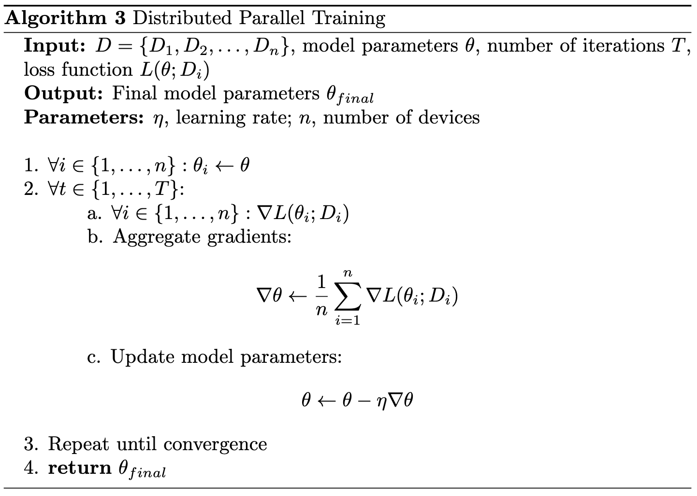
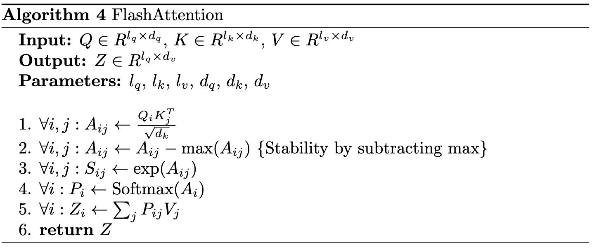

# LLaMA 3.2 Architecture -- The Key Innovations

## Introduction
LLaMA 3.2 builds on the Transformer architecture but introduces significant innovations that improve efficiency and scalability. This document outlines key architectural changes, including Grouped Query Attention (GQA) and other enhancements in tokenization and parallelization.

## 1. Pre-Training Techniques

### What is Pre-Training?
- Pre-training is the process of training a model on large-scale datasets to learn general language patterns and representations.
- It forms the foundation for the model's understanding of language before fine-tuning on specific tasks.

### How Pre-Training Affects Models
- Enables better generalization across various tasks.
- Improves model performance with fewer task-specific data points.
- Reduces the need for extensive fine-tuning.

### Problem Addressed by Pre-Training
- Overcomes the limitation of task-specific training data scarcity.
- Enhances the model's ability to understand context and nuances in language.

### LLaMA 3.2 Pre-Training Innovations
- Adaptive learning rates: Optimizes learning process for different parts of the model.
- Gradient accumulation: Allows for effective training on larger batch sizes, even with limited hardware.
- Focus on efficiency: Achieves better generalization while reducing compute costs.

## 2. Changes in Core Components

### Attention Mechanism: Grouped-Query Attention (GQA)

**Why this matters**:
- Faster processing of long text sequences.
- More efficient attention computations.
- Reduces computational overhead, making it more scalable.

- **Faster Computations**: By dividing the query matrix into groups, GQA accelerates the attention mechanism, especially when handling large sequences of data.
- **Reduced Memory Load**: It decreases the overall memory footprint as fewer computations are required for each group of queries.
---

### Tokenization Improvements

**Why this matters**:
- Enhanced tokenization methods to minimize token count.
- Improves memory efficiency and reduces computation load.
- Maintains output quality with fewer tokens.
- **Fewer tokens**: The model now needs fewer tokens to represent the same input, leading to faster processing times and reduced computational overhead.
- **Memory efficiency**: With fewer tokens to process, the memory required for tokenization decreases, allowing the model to handle longer sequences without running out of resources.

LLaMA 3.2 introduces improved tokenization using an advanced version of Byte Pair Encoding (BPE). Tokenization is the process of breaking text into smaller units (tokens) that the model can process.

Byte Pair Encoding (BPE) is a subword segmentation algorithm that iteratively merges the most frequent pairs of characters or character sequences in the text. Initially, each character in the text is treated as a separate token. BPE then identifies the most common pair of adjacent tokens and merges them into a single token. This process is repeated until a predefined vocabulary size is reached or no more pairs can be merged.

For example, consider the word "lower". Initially, it is tokenized as ['l', 'o', 'w', 'e', 'r']. If 'l' and 'o' are the most frequent pair, they are merged to form ['lo', 'w', 'e', 'r']. The next most frequent pair might be 'lo' and 'w', resulting in ['low', 'e', 'r']. This merging process continues, creating tokens that are more efficient for processing while preserving the meaning of the input text.

The improvement in LLaMA 3.2’s tokenization lies in its optimized vocabulary and better handling of subword representations. This leads to fewer tokens being generated for the same text, which enhances processing efficiency and reduces computational overhead.

---

### Parallelization Enhancements

**Why this matters**:
- Improves distributed training and inference capabilities.
- Enables faster model training, especially for large models.
- Efficiently utilizes distributed systems, reducing overall training times.
- **Faster training**: By splitting the dataset across multiple devices, the training time is significantly reduced, especially for large-scale models.
- **Scalability**: The architecture can be scaled across more devices as needed, making it ideal for large datasets or high-dimensional models.
Distributed parallelization in LLaMA 3.2 allows for the model to be trained across multiple devices (GPUs), efficiently dividing the data and computation among them.

Traditional training involves using a single GPU to handle the entire dataset. This can lead to slow training times, especially for large models like LLaMA 3.2.

Parallel training solves this by distributing the dataset across multiple GPUs and synchronizing the computation across them.

Step-by-step breakdown:

1. Partition the dataset \(D\) into smaller chunks, \(D_1, D_2, ..., D_n\), where each chunk is assigned to a different device.
2. Each device computes the gradients of its assigned data independently.
3. The gradients are then aggregated across all devices to update the model parameters.
4. This process is repeated until the model converges.

---

### Flash Attention

**Why this matters**:
- Significantly reduces memory overhead during attention calculations.
- Improves both speed and accuracy in training large models.
- **Reduced memory consumption**: Flash Attention cuts down the amount of memory required during training, making it possible to train larger models on smaller hardware setups.
- **Increased speed**: The attention mechanism becomes faster by avoiding memory-intensive operations.

Flash Attention is an optimization of the attention mechanism that reduces the amount of memory required during training.

In standard attention, all attention scores are computed and stored in memory, which can become very expensive for large models.

Flash Attention reduces this overhead by applying memory-efficient techniques such as stability tricks to prevent large intermediate values from consuming too much memory.

Step-by-step breakdown:

Compute the dot product between each query and key pair.
Subtract the maximum score from the result to stabilize the computation.
Apply the softmax function to normalize the scores.
Multiply the resulting scores by the value matrix to get the final output.

---

## 3. Fine-Tuning Advancements

### Why LLaMA 3.2 is Easier to Fine-Tune
- Improved pre-training foundation requires less task-specific adaptation.
- Architectural optimizations allow for more efficient parameter updates.
- Better generalization capabilities from the pre-training phase.

### Reduced Data and Compute Requirements
- Fewer data points needed:
  - Enhanced pre-training allows the model to adapt with less labeled data.
  - Better transfer learning capabilities from general to specific tasks.
- Lower compute needs:
  - Efficient architecture allows fine-tuning on modest hardware.
  - Reduced memory footprint during fine-tuning process.
  - Faster convergence due to improved pre-training.

**Why this matters**:
- Smaller teams and researchers can adapt the model with fewer resources.
- Easier application to niche or specialized domains.
- More cost-effective, reducing the need for extensive computational resources.

## Conclusion
LLaMA 3.2's architectural innovations in pre-training, core components, and fine-tuning capabilities position it as a highly efficient and accessible large language model. These advancements allow for high performance with minimal resource demands, making it suitable for a wide range of AI applications and environments.
