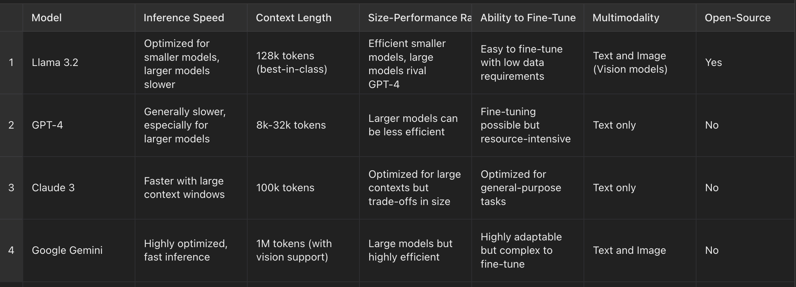

# **LLaMA 3.2 Limitations**

## Introduction
LLaMA 3.2 represents a significant leap forward in the world of open-source large language models, but like any model, it is not without its limitations. When compared to models like GPT-4, Claude 3, and Google's Gemini, LLaMA 3.2 has some areas where it falls short. This document outlines the most notable limitations in terms of **inference speed**, **context length**, **size-performance ratio**, and **fine-tuning capabilities**.

## 1. **Inference Speed**
LLaMA 3.2, while optimized for smaller models, struggles in terms of inference speed for its larger models. This presents a challenge in **real-time applications** where responsiveness is crucial.

- **Limitation**: Larger models like LLaMA 3.2 exhibit slower inference speeds compared to competitors like **Google Gemini**, which is highly optimized for fast inference across larger model sizes.
- **Impact**: This can hinder its usage in environments where low-latency performance is essential, such as chatbots, live AI assistants, or interactive applications.

## 2. **Context Length**
Despite LLaMA 3.2's impressive **128k tokens** of context length, there are still areas where it is outperformed.

- **Limitation**: LLaMA 3.2's context length, while best-in-class in many cases, is surpassed by **Google Gemini** with a staggering **1M tokens** (including vision support), making it a superior option for tasks that involve long document processing or conversations.
- **Impact**: This could limit LLaMA 3.2's effectiveness in scenarios that require extremely long context handling, such as **legal document analysis** or **multimodal tasks** where context is critical.

## 3. **Size-Performance Ratio**
While LLaMA 3.2 performs well in the **size-performance trade-off** for smaller models, it does not maintain this edge as the model size increases.

- **Limitation**: As model sizes scale up, LLaMA 3.2 is not as efficient as **Claude 3** or **Google Gemini**, both of which have been optimized for large-context tasks with minimal trade-offs in terms of performance.
- **Impact**: This can make LLaMA 3.2 less appealing for very large, resource-intensive projects where maintaining an optimal size-performance ratio is key.

## 4. **Ability to Fine-Tune**
Although LLaMA 3.2 is easier to fine-tune compared to many other open-source models, it is still outclassed by more adaptable models like **Google Gemini**.

- **Limitation**: Fine-tuning LLaMA 3.2, especially for large downstream tasks, can require significant data and compute power, unlike **Google Gemini**, which is highly adaptable but remains complex to fine-tune.
- **Impact**: This can limit LLaMA 3.2's appeal for smaller teams or researchers who need a highly adaptable model without extensive hardware requirements.

## Conclusion
While LLaMA 3.2 has many strengths, its limitations become apparent when compared to state-of-the-art models like **GPT-4**, **Claude 3**, and **Google Gemini**. Areas such as inference speed, context length, and size-performance ratio are where these models may offer superior performance. Understanding these limitations is crucial for making informed decisions when choosing which model to deploy for specific applications.

