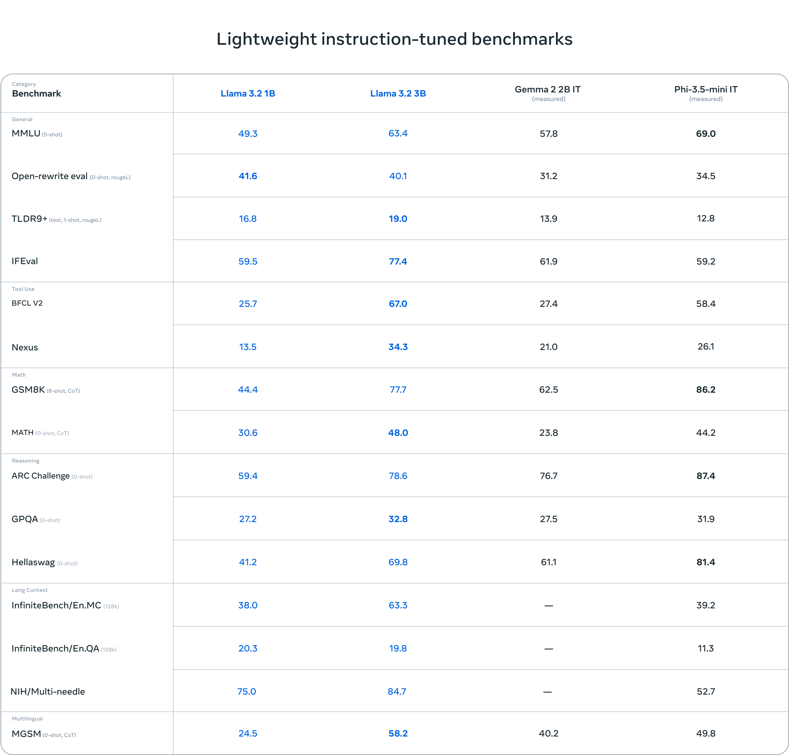
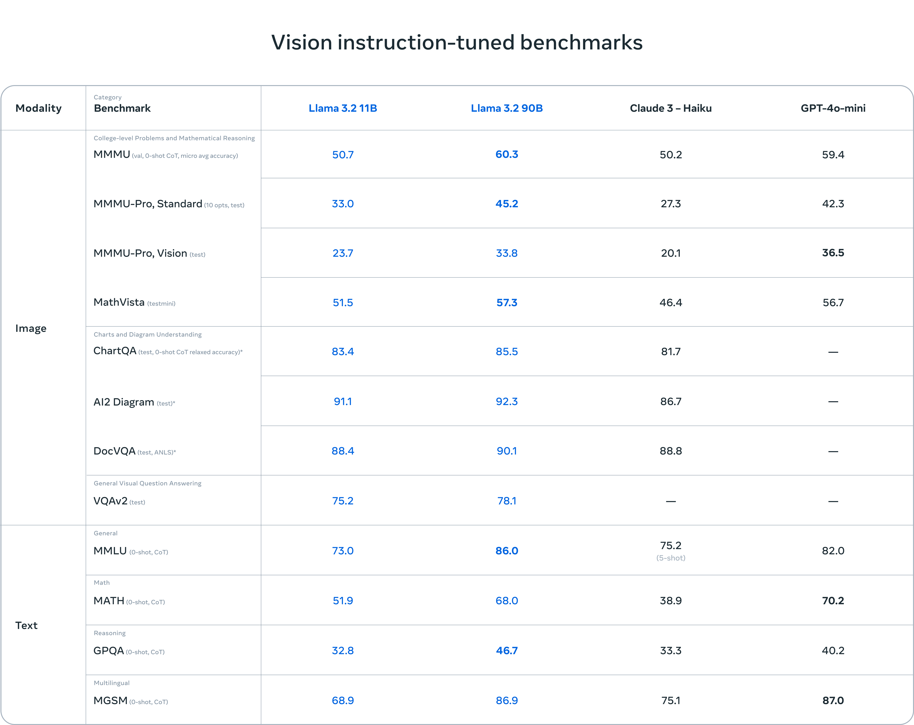

# Overview: LLaMA 3.2

### 1. Context: Why the LLaMA Family Exists
LLaMA (Large Language Model Meta AI) models were developed by Meta with the goal of providing open-source large language models that rival proprietary models. The motivation behind the LLaMA family, particularly with LLaMA 3.2, is to:

1. Close the gap between open-source models and proprietary ones in terms of performance, accessibility, and ease of fine-tuning.
2. Optimize scalability and efficiency, allowing high-performance models to be deployed and fine-tuned even in resource-constrained environments, such as edge devices or smaller labs.
3. LLaMA 3.2 introduces multimodal capabilities (text + image) in its larger models (11B and 90B) while maintaining its hallmark features of scalability, efficiency, and accessibility in its smaller models (1B and 3B).

#### Benchmarks for Lightweight Instruction-Tuned Models

LLaMA 3.2 demonstrates impressive performance across various benchmarks, particularly considering its smaller model sizes. Let's compare LLaMA 3.2's 1B and 3B models against other lightweight instruction-tuned models:

Key observations:
1. LLaMA 3.2 3B outperforms Gemma 2 2B IT on MMLU, showcasing its strong general language understanding.
2. Both LLaMA 3.2 models excel in the Open-rewrite eval, surpassing Gemma 2 2B IT and Phi-3.5 - Mini IT, indicating their effectiveness in real-world, open-source scenarios.
3. LLaMA 3.2 3B shows competitive performance in mathematical reasoning (GSM8K, MATH), especially compared to Gemma 2 2B IT, though there's room for improvement compared to Phi-3.5 - Mini IT.
4. In long context tasks, LLaMA 3.2 models demonstrate strong capabilities, particularly in the NIH/Multi-needle benchmark where they significantly outperform Phi-3.5 - Mini IT.
5. LLaMA 3.2 3B shows impressive multilingual capabilities in the MGSM benchmark, outperforming both Gemma 2 2B IT and Phi-3.5 - Mini IT.

These benchmarks highlight LLaMA 3.2's efficiency in achieving strong performance with fewer parameters, making it an attractive option for resource-constrained environments and applications requiring a balance of performance and efficiency.

#### Vision Instruct-Tuned Benchmarks

LLaMA 3.2 also showcases robust performance in vision-related tasks, particularly with its larger multimodal models (11B and 90B). Here's a comparison of LLaMA 3.2's performance against other vision-language models on various benchmarks:

Key insights:
1. LLaMA 3.2 90B model demonstrates competitive performance across all benchmarks, often rivaling or surpassing GPT-4v-mini, especially in vision-related tasks.
2. The 11B model shows impressive results for its size, outperforming some larger models on certain tasks and providing a strong balance between performance and efficiency.
3. LLaMA 3.2 models excel in vision tasks such as ChartQA and AI2 Diagram, showcasing their strong visual understanding capabilities.
4. In text-based tasks, LLaMA 3.2 demonstrates robust performance in MMLU and MGSM, highlighting its language understanding and multilingual capabilities.
5. The models exhibit balanced performance across different modalities, underlining their versatility in handling vision, image, and text-based tasks.

These benchmarks underscore LLaMA 3.2's capabilities in multimodal understanding and reasoning, positioning it as a formidable contender in the vision-language model space while also demonstrating strong competence in text-only tasks. The model's ability to perform well across various modalities and task types makes it a versatile choice for a wide range of applications, from academic research to industry implementations.

### 2. Problem Addressed: Hardware and Efficiency Constraints

Traditional large language models face significant challenges:
- High resource demands, especially for models like GPT-4
- Limited accessibility due to substantial compute requirements
- Barriers to fine-tuning for users with limited resources

LLaMA 3.2 aims to address:
1. Resource consumption: Reduce GPU and compute needs for training and inference
2. Fine-tuning accessibility: Enable easy model adaptation with limited data and compute

### 3. Approach: Innovations in Pre-training and Fine-tuning

Focus: Architectural changes enabling LLaMA's impressive performance

Pre-training is a crucial step in the development of language models, defined as the process of learning general language patterns from large-scale datasets before task-specific fine-tuning. This approach allows models to build a strong foundation of language understanding that can be later adapted to various tasks.

The main problem addressed by LLaMA 3.2's pre-training approach is the optimization of this process for better generalization and reduced compute costs. By focusing on efficient pre-training techniques, the model aims to achieve high performance while minimizing resource requirements.

A key contributor to LLaMA 3.2's success is its advanced pre-training capabilities. These innovations enable the model to learn more effectively from data, resulting in improved performance across a wide range of tasks while maintaining efficiency in terms of computational resources.

Pre-training Techniques:
- Adaptive learning rates
- Gradient accumulation
- Improved generalization with fewer data points

### 4. Key Architectural Innovations

1. Attention Mechanism: Grouped-Query Attention (GQA)
   - Faster processing of long sequences
   - More efficient attention computations
   - Reduced computational overhead

2. Tokenization Improvements:
   - Minimized token count
   - Enhanced memory efficiency
   - Reduced computation load without quality loss

3. Parallelization Enhancements:
   - Faster model training and inference
   - Efficient use of distributed systems
   - Reduced overall training times

### 5. Easier Fine-Tuning: Resource-Efficient Adaptation

Standout Feature: Easy fine-tuning on low-resource setups

Benefits:
- Fewer data requirements: Adapt to specific tasks with less labeled data
- Lower compute needs: Fine-tune on modest hardware setups

Impact:
- Accessible to smaller teams, researchers, and startups
- Enables adaptation to niche applications without massive resources

## Conclusion

LLaMA 3.2: Bridging open-source accessibility and high performance

Key Strengths:
- Efficiency: High performance with minimal resource demands
- Multimodal support: Strong capabilities across text and vision tasks
- Easy fine-tuning: Highly adaptable for various AI applications

Positioning: A versatile, efficient model suitable for a wide range of use cases, from research to industry implementations